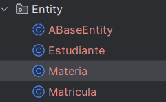

# INFORME TRABAJO ELECTIVA

## Se crea la base de datos con el patron Abstract Factory:


* Se crea una supeclase Llamada ABaseEntity, donde en esta se crearan los metodos que se puedan repetir en las demás entidades:

````` Java
package com.corhuila.trabajo2_electiva.Entity;

import jakarta.persistence.*;

import java.time.LocalDateTime;

@MappedSuperclass
public abstract class ABaseEntity {
    @Id
    @GeneratedValue(strategy = GenerationType.IDENTITY)
    private Long id;

    @Column(name = "state", nullable = false)
    private Boolean state;


    @Column(name = "created_at", nullable = true)
    private LocalDateTime createdAt;


    @Column(name = "updated_at", nullable = true)
    private LocalDateTime updatedAt;


    @Column(name = "deleted_at", nullable = true)
    private LocalDateTime deletedAt;

    public Long getId() {
        return id;
    }

    public void setId(Long id) {
        this.id = id;
    }

    public Boolean getState() {
        return state;
    }

    public void setState(Boolean state) {
        this.state = state;
    }

    public LocalDateTime getCreatedAt() {
        return createdAt;
    }

    public void setCreatedAt(LocalDateTime createdAt) { this.createdAt = createdAt;  }

    public LocalDateTime getUpdatedAt() {
        return updatedAt;
    }

    public void setUpdatedAt(LocalDateTime updatedAt) {
        this.updatedAt = updatedAt;
    }

    public LocalDateTime getDeletedAt() {
        return deletedAt;
    }

    public void setDeletedAt(LocalDateTime deletedAt) {
        this.deletedAt = deletedAt;
    }
}

`````
* Se crean las diferentes Entidades consus atributos y metodos.

